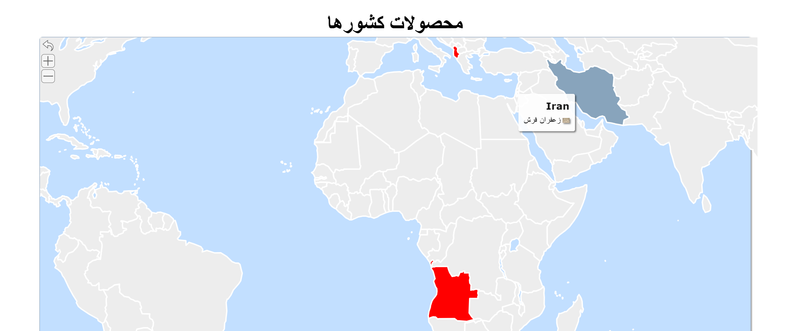

# 🗺️ Hover World Map - Countries and Their Information

An interactive SVG world map that displays custom information such as capital cities, main products, or population when hovering over each country.

## 🌐 see a screenshot:



---

## ✨ Features

- Full SVG world map
- Hover effect on each country displaying custom data
- Country highlights on hover
- Easily extendable for more data points
- Fully customizable styles and behavior

---

## 🧩 Technologies Used

| Component | Description |
|-----|---------|
| HTML |Page structure |
| CSS | Styling customizable |
| JavaScript | Interaction handling, hover effects, and data display|
| SVG |World map using scalable vector paths |

---

## 🗃️ Resources

📍 [Direct link to the map](https://simplemaps.com/resources/svg-world)

---

## 🔧How to Use

1. Clone or download the project:
   ```bash
   git clone https://github.com/Hover_World/.git
